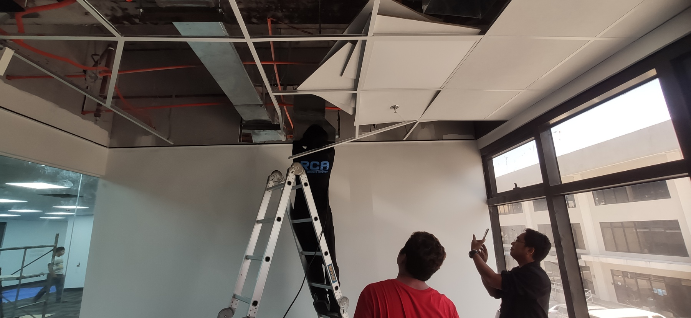
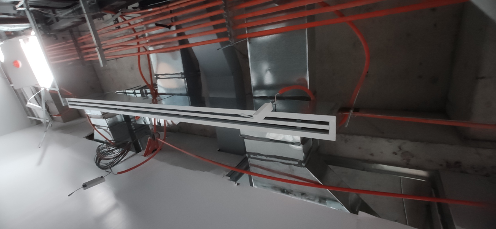

# WEEKLY REPORT 36

**Weekly Progress Report**

**Project/Task Details:**
- **Project Name:** SWAK BPO RELOCATION AND INSTALLATION

**Completion:**
- 68%

**Key Accomplishments:**

- LIGHT TEST  

- CONTINOUS RELOCATION AND INSTALLATION

.jpg)

.jpg)
.jpg)
.jpg)

.jpg)
.jpg)
.jpg)
.jpg)
.jpg)
.jpg)
.jpg)

.jpg)
.jpg)
.jpg)
.jpg)

- SUBMITTED PROGRESS BILLING FOR 62%

**Project/Task Details:**
- **Project Name:** HANN TEMFACIL

**Completion:**
- 0%

**Key Accomplishments:**
- WAITING FOR PO

**Project/Task Details:**
- **Project Name:** Aeropark 717 COFFEE SHOP
**Completion:**
- 0%
**Key Accomplishments:**
- SITE SURVEY

- PHOTOS

**Project/Task Details:**
- **Project Name:** OFFICE CLARK 10
**Completion:**
- 0%
**Key Accomplishments:**
- Negotiated Price 

**Project/Task Details:**
- **Project Name:** ALVIERA AVIDA
**STATUS:**
- PENDING

**Project/Task Details:**
- **Project Name:** SWAK BPO 5TH FLOOR
**STATUS:**
- PENDING

**Project/Task Details:**
- **Project Name:** WEST GO CHIEFT DUCTED TYPE ACU
**STATUS:**
- PENDING

---
